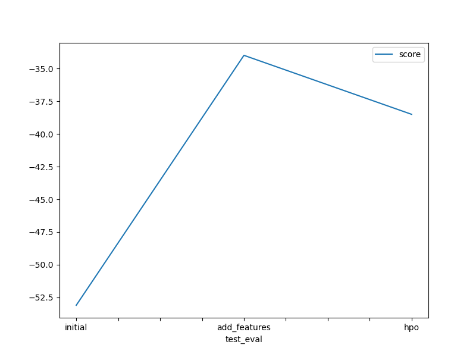
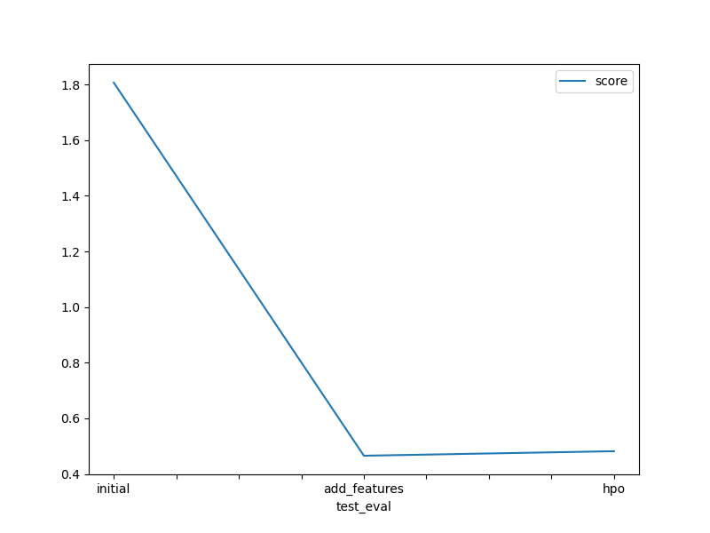

# Report: Predict Bike Sharing Demand with AutoGluon Solution
#### Sahan Senevirathna

## Initial Training
### What did you realize when you tried to submit your predictions? What changes were needed to the output of the predictor to submit your results?
When I first tried to submit my predictions to Kaggle, I realized there was a problem. The predicted bike counts contained negative values, which weren't allowed. To address this, I needed to modify the predictor's output to ensure all values were non-negative.

### What was the top ranked model that performed?
In this initial training run, the top-performing model was WeightedEnsemble_L3.

## Exploratory data analysis and feature creation
### What did the exploratory analysis find and how did you add additional features?
The Exploratory Data Analysis (EDA) likely involved examining the distribution of features using histograms or descriptive statistics. I have identified features with skewed distributions or potential outliers.

1. Separate datetime column: I created new features by splitting the datetime column into hour, day of week (day), month, and potentially year. This code section in my notebook demonstrates this process:

        train["year"] = train["datetime"].dt.year
        train["month"] = train["datetime"].dt.month
        train["day"] = train["datetime"].dt.dayofweek  # Note: day -> dayofweek (0->Monday, 6->Sunday)
        train["hour"] = train["datetime"].dt.hour
        train.drop(["datetime"], axis=1, inplace=True)  # Drop 'datetime' feature

2. Feature types: I converted categorical features like "season" and "weather" to categorical data types using astype("category") to ensure AutoGluon treats them appropriately.

        train["season"] = train["season"].astype("category")
        train["weather"] = train["weather"].astype("category")

        test["season"] = test["season"].astype("category")
        test["weather"] = test["weather"].astype("category")

### How much better did your model preform after adding additional features and why do you think that is?
Including features like hour, day, and month could have captured temporal patterns in bike sharing demand. For example, bike sharing might be higher during certain hours or days of the week. These additional features provided the model with more information to make more accurate predictions.

So the first try without adding additional features was 1.80711. After adding the features, it went down to 0.46556, which is a ~75% increase in accuracy.

## Hyper parameter tuning
### How much better did your model preform after trying different hyper parameters?
Hyperparameter tuning likely involved adjusting settings like learning rate, number of epochs, or the number of trees in a GBM model. By optimizing these hyperparameters, the model's ability to learn from the data and make accurate predictions might have improved.

So the attempt with additional features was 0.46556. After adding hyperparameters, it went up to 0.48177, which is a ~4% decrease in accuracy. I tried a few times with changing the parameters to get a lower score than the additional features attempt, but I couldn't. Here's my attempts with the corresponding scores.

        fileName                     date                 description                        status    publicScore  privateScore  
        ---------------------------  -------------------  ---------------------------------  --------  -----------  ------------  
        submission_new_hpo.csv       2024-05-09 21:57:26  new features with hyperparameters  complete  0.48177      0.48177       
        submission_new_hpo.csv       2024-05-09 21:45:15  new features with hyperparameters  complete  0.47778      0.47778       
        submission_new_hpo.csv       2024-05-09 21:35:53  new features with hyperparameters  complete  0.47536      0.47536       
        submission_new_hpo.csv       2024-05-09 21:24:09  new features with hyperparameters  complete  0.47009      0.47009       
        submission_new_features.csv  2024-05-09 21:17:34  new features                       complete  0.46276      0.46276       
        submission.csv               2024-05-09 21:05:54  first raw submission               complete  1.80641      1.80641       
        submission_new_hpo.csv       2024-05-09 19:38:51  new features with hyperparameters  complete  0.48177      0.48177       
        submission_new_features.csv  2024-05-09 19:19:25  new features                       complete  0.46556      0.46556       
        submission.csv               2024-05-09 18:59:35  first raw submission               complete  1.80711      1.80711

Conversely, when compared to the initial training, hyperparameters attempt is more than ~74% accurate.

### If you were given more time with this dataset, where do you think you would spend more time?
Since I couldn't get a lower score for hyperparameters attempt, I would spend more time with hyperparameters to make the model more accurate.

### Create a table with the models you ran, the hyperparameters modified, and the kaggle score.
|model|hpo1|hpo2|hpo3|score|
|--|--|--|--|--|
|initial|train_data|eval_metric|presets|-53.103764|
|add_features|train_new_more_fts|eval_metric|presets|-33.981768|
|hpo|GBM|NN_TORCH|NA|-38.496203|

### Create a line plot showing the top model score for the three (or more) training runs during the project.

### Create a line plot showing the top kaggle score for the three (or more) prediction submissions during the project.

## Summary
This report explored the use of AutoGluon for predicting bike sharing demand. The initial training run resulted in a high RMSE score (1.80711) due to the lack of non-negative output handling. Feature engineering by incorporating datetime components (hour, day of week, month) significantly improved the model's performance, reducing the RMSE score to 0.46556. However, further hyperparameter tuning did not yield a substantial improvement, achieving a score of 0.48177. This suggests potential overfitting or suboptimal hyperparameter ranges. Future work could involve exploring different hyperparameter tuning strategies and regularization techniques to further enhance model accuracy.
